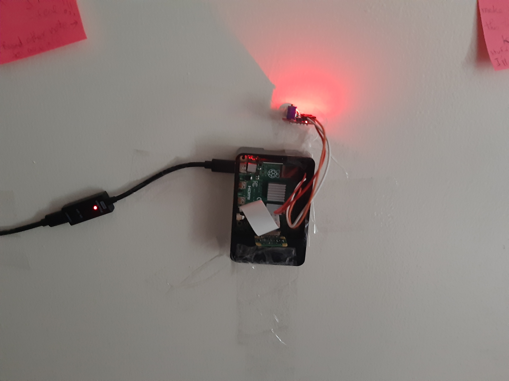

# UPS
### This is what happens when you miss your UPS order...

So basically, earlier last week I was supposed to get an order from UPS. Unfortunately, I missed that order because I had my headphones on at the time. When I called UPS, I was told they'd come the next business day which was June 22, 2020. However, I received <a href="./images/piss.jpg">this</a> on my door yesterday (Sunday). So, clearly someone was misinformed. And to make sure UPS doesn't miss my package again, I built a sound sensor that will alert me as soon as someone knocks on the door of my apartment.

So here's how it works in a nutshell. The UPS guy knocks on the door. A sudden change in frequency is picked up by KY-038 Sound Sensor module (see images 1-2). This will be reflected by a digital HIGH (i could've done analog and set threshold but was too lazy to implement an ADC lol, Digital out gets the work done in this case) and send this signal to me (my laptop) over a <a href="https://en.wikipedia.org/wiki/WebSocket">websocket</a> via my Raspberry Pi as the server and my laptop as the client. This alert will be sent as a boolean which when true indicates that someone knocked on the door and will alert me by playing a 30-second audio clip which will clearly make me aware that someone just knockd on the damn door.

### Moral of the story: Engineers are proactively lazy!
<ol>
  <li>Sound (knock) to Digital Output ✅</li>
  <li>Websockets
    <ol>
      <li>Client ✅</li>    
      <li>Server ✅</li>    
    </ol>
  </li>
  <li>Socket Communication ✅</li>
  <li>Hardware Setup ✅</li>  
</ol>

### Working Prototype:

